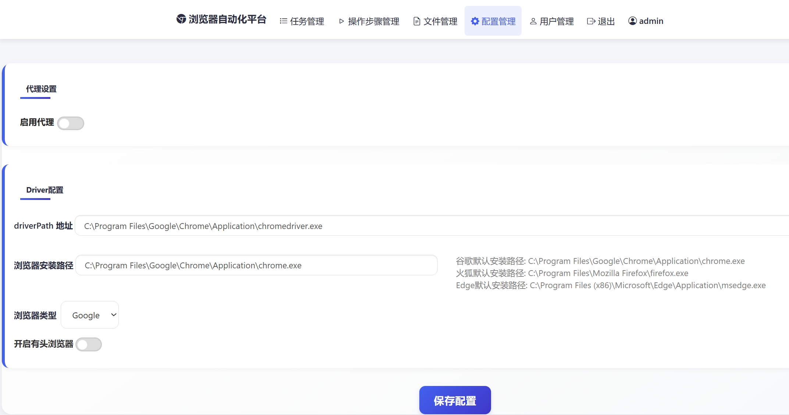
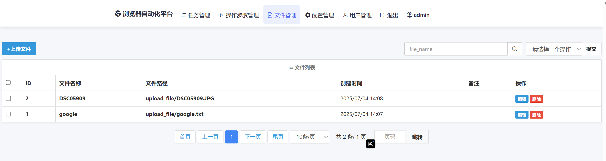
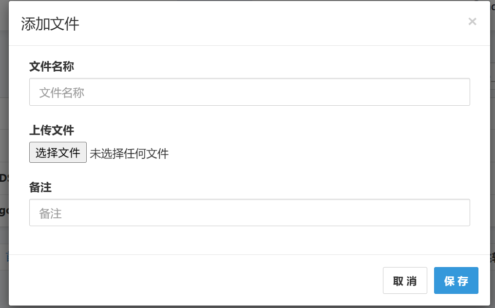
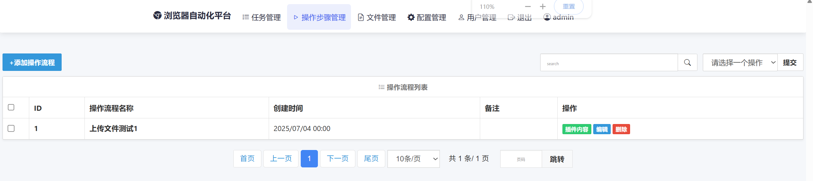
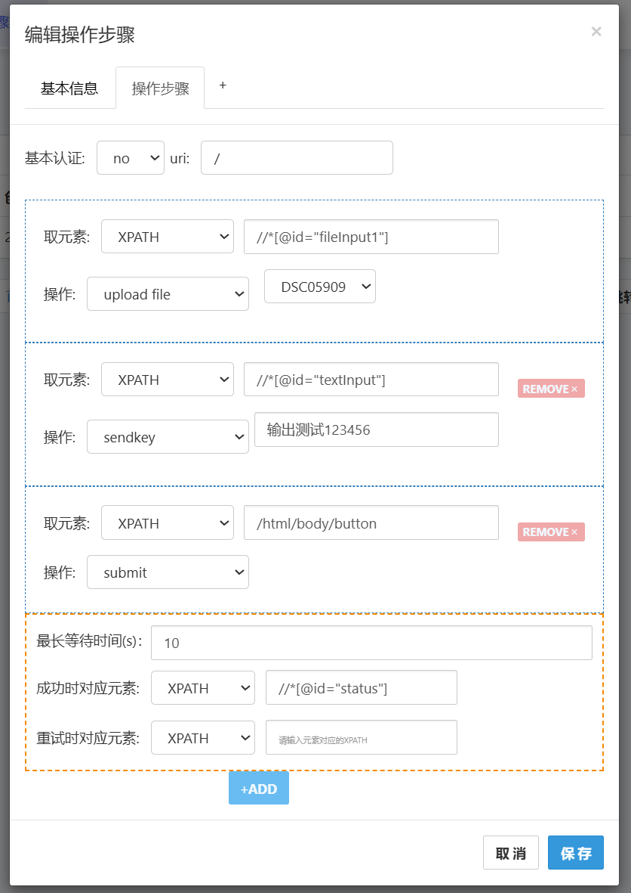
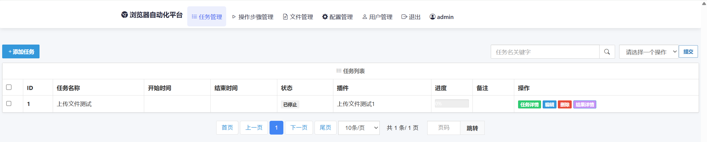
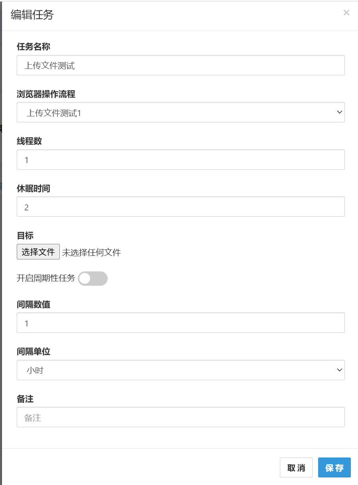
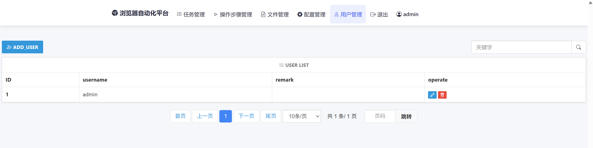
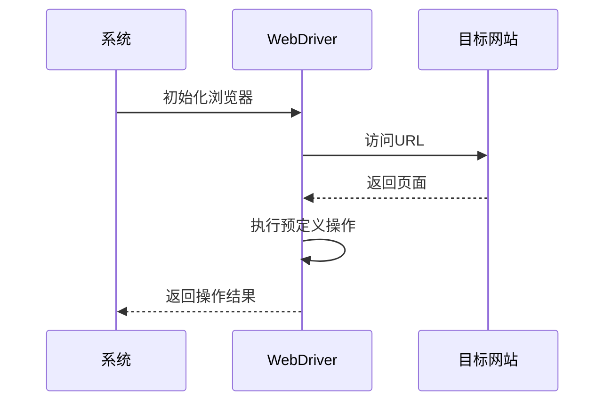

浏览器自动化系统使用指南

## 目录

- [核心功能](#核心功能)
- [技术亮点](#技术亮点)  
- [部署指南](#部署指南)
- [快速使用](#快速使用)
- [界面截图](#界面截图)
- [详细功能说明](#详细功能说明)
- [目标文件格式要求](#目标文件格式)
- [配置建议](#高级配置与优化)
- [常见问题](#常见问题)

## 核心功能

本系统是基于Selenium的浏览器自动化工具，支持以下浏览器：

- Chrome
- Firefox  

主要功能包括：

- **元素操作**：点击、输入文本、上传文件等
- **元素定位**：支持XPath、ID、Name、ClassName等多种方式
- **验证码处理**：自动识别常见验证码（需配合ddddocr）
- **流程控制**：多步骤配置、条件执行
- **任务调度**：定时执行、批量处理
- **容错机制**：操作重试、超时设置
- **复杂场景**：支持多页面/多接口连续操作

> **注意**：使用前请确保已安装对应浏览器驱动 
>
> docker环境中已经安装Chrome和Firefox 浏览器和对应的浏览器驱动。浏览器路径：
>
> Chrome：  /usr/bin/google-chrome
>
> Firefox ： /usr/bin/firefox/firefox
>
> 驱动路径：

> Chrome： /app/chromedriver
>
> Firefox ：/app/geckodriver
>

## 技术亮点

1. **智能元素定位**：
   - 自动重试机制确保操作稳定性
   - 多定位方式可供选择（XPath/CSS/ID等）
   - 智能等待页面加载完成
2. **高效任务调度**：
   - 支持高并发执行
   - 动态资源分配
   - 失败任务自动重试
3. **便捷管理**：
   - 可视化流程配置
   - 实时监控任务状态

## 部署指南

### 1. 环境要求

| 组件   | 版本要求                                                     |
| ------ | ------------------------------------------------------------ |
| Python | ≥3.8                                                         |
| Django | 4.1                                                          |
| linux  | ubuntu22.04   (内核版本不能太低, 不然本项目的docker环境可能会运行不起来）) |

### 2. 安装步骤

```bash
# 1. 克隆项目
git clone https://github.com/fankun99/BrowserAutoCrawl.git

# 2. 在Releases中下载docker镜像文件（BrowserAutoCrawl.tar），然后执行下面的命令加载镜像
docker load -i BrowserAutoCrawl.tar

cd BrowserAutoCrawl

#3.替换证书（可选）
将证书文件替换cert文件夹下的user_certificate.crt和user_private.key文件。

#4.部署容器
docker-compose up -d
```

## 快速使用

### 创建第一个自动化流程

1. 访问 `https://<server-ip>/login/ 或者 http://<server-ip>/login/`
   - 默认账号: admin/admin

#### 0. 基本配置

进入"配置管理"完成以下设置：

- 浏览器类型选择（Chrome/Firefox/Edge）

- 代理设置（如需）

- 浏览器模式（有头/无头）

- 其他参数（按需配置）

  > docker环境中已经安装Chrome和Firefox 浏览器和对应的浏览器驱动。浏览器路径：
  >
  > Chrome：  /usr/bin/google-chrome
  >
  > Firefox ： /usr/bin/firefox/firefox
  >
  > 驱动路径：

  > Chrome： /app/chromedriver
  >
  > Firefox ：/app/geckodriver

#### 1. 创建操作流程

进入"操作步骤管理" → 点击"+添加操作流程"，填写：

- **流程名称**：描述性名称（如"用户登录"）
- **错误重试次数**：建议3-5次
- **元素等待时间**：默认10秒（根据网络情况调整）

#### 2. 配置操作步骤

在"操作步骤"中设置：

- 网站认证信息（如需）
- 具体操作指令（点击、输入等）
- 成功判定条件

#### 3. 保存操作流程

点击"保存"按钮完成流程配置

#### 4. 创建并执行任务

进入"任务管理" → 点击"+添加任务"，设置：

- **任务名称**：描述性标识
- **选择流程**：关联已创建的操作流程  
- **执行参数**：
  - 线程数（并发数量）
  - 请求间隔（秒）
  - 目标文件（包含URL列表）
  - 定时任务（可选）

## 界面截图

### 1. 配置管理



### 2. 文件管理



上传文件（文件名称可按需填写，不填写时默认为上传文件的文件名）：



### 3. 操作界面管理





### 4. 任务管理





### 5. 用户管理




## 详细功能说明

### 元素定位与操作类型

- 支持XPath、ID等多种定位方式
- 封装常见操作：点击、输入、上传等
- 智能等待机制确保元素加载完成

| 操作类型           | 说明                             |
| ------------------ | -------------------------------- |
| send_key           | 文本输入                         |
| submit             | 表单提交                         |
| upload_file        | 文件上传（需要将文件上传到系统） |
| get_captcha_image  | 获取验证码图片                   |
| auto_get_captcha   | 自动识别并输入验证码             |
| send_key_from_file | 从文件读取输入内容               |
| accept_alert       | 自动处理弹窗                     |

### 验证码处理

如果你的操作流程需要自动识别并输入验证码，请按如下步骤配置：

1. 添加操作步骤，选择"获取验证码图片"类型：
   - 系统会自动捕获验证码图片并保存临时路径

2. 添加后续操作步骤，选择"自动输入验证码"类型：  
   - 系统会调用ddddocr库识别验证码
   - 自动将识别结果填入指定输入框

> **最佳实践**：
>
> - 两个步骤应连续配置
> - 确保验证码输入框定位准确
> - 复杂验证码建议设置更高的重试次数

**处理流程**:

```python
def captcha_identify(img_path):
    if 是base64编码:
        解码图片
    else:
        下载图片
    调用ddddocr识别
    返回识别结果
```

### 操作重试与超时设置

- 每个操作步骤都可以设置"目标错误重试次数"和"元素最长等待时间（秒）"
- 当目标元素未在指定时间内出现或操作失败时，系统会自动重试，直到达到最大重试次数

### 多页面/多接口连续操作

系统支持多步骤连续操作：

1. 按顺序添加多个操作步骤
2. 只有前一步骤成功才会执行下一步
3. 任何步骤失败将终止整个流程

## 目标文件格式

### 基础URL文件格式

```
http://site1.com
https://web2.com
```

### 带参数URL文件格式

```
http://site1.com key1 key2
http://site2.com key1 key2
```

## 浏览器自动化流程



## 高级配置与优化

### 性能优化建议

1. **浏览器设置**：
   - 启用无头模式(headless)减少资源占用
   - 设置合适的页面加载超时时间
2. **任务调度**：
   - 根据目标网站承受能力调整并发数
   - 设置合理的请求间隔时间
   - 分批处理大量目标URL
3. **网络优化**：
   - 使用优质代理IP

## 常见问题

### 1. 浏览器无法启动

- 在docker中无法使用有头浏览器
- 检查浏览器驱动是否安装正确
- 确认浏览器版本与驱动版本匹配
- 检查是否有其他程序占用浏览器端口

### 2. 元素定位失败

- 确认元素定位表达式是否正确
- 适当增加元素等待时间
- 检查页面是否加载完成

### 3. 任务执行速度慢

- 优化网络连接
- 适当增加线程数
- 减少不必要的等待时间
